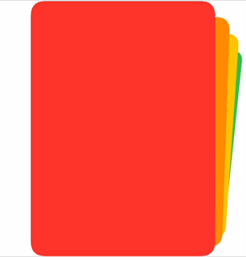

# CardStack
A SwiftUI view that arranges its children in a whimsical interactive deck of cards.



CardStack mimics the behaviour of the photo stack in iMessage, as well as the "Top Stories" in [Big News](https://bignews.app).

## Overview
You create stacks dynamically from an underlying collection of data. Each item in the collection must conform to `Identifiable`. 

```swift
CardStack(items) { item in
    RoundedRectangle(cornerRadius: 20, style: .continuous)
        .fill(item.color)
        .frame(height: 400)
}
```

## Supporting selections in stacks 
To make members of a stack selectable, install a tap gesture inside the view provider.

```swift
CardStack(items) { item in
    RoundedRectangle(cornerRadius: 20, style: .continuous)
        .onTapGesture {
            // do something
        }
}
```

To get a stack's topmost card index, provide a binding to the `currentIndex` initialiser.

```swift
@State private var currentIndex = 0

CardStack(items, currentIndex: $currentIndex) { item in
    ...
}
```

## Installation
Add CardStack to your app's Package.swift file:

```swift
.package(url: "https://github.com/notsobigcompany/CardStack")
```

Alternatively, add it in Xcode by going to File -> Add Packages. 

A SwiftUI preview is available in the CardStack file itself.

## License
Copyright 2022 NOT SO BIG TECH LIMITED

Permission is hereby granted, free of charge, to any person obtaining a copy of this software and associated documentation files (the "Software"), to deal in the Software without restriction, including without limitation the rights to use, copy, modify, merge, publish, distribute, sublicense, and/or sell copies of the Software, and to permit persons to whom the Software is furnished to do so, subject to the following conditions:

The above copyright notice and this permission notice shall be included in all copies or substantial portions of the Software.

THE SOFTWARE IS PROVIDED "AS IS", WITHOUT WARRANTY OF ANY KIND, EXPRESS OR IMPLIED, INCLUDING BUT NOT LIMITED TO THE WARRANTIES OF MERCHANTABILITY, FITNESS FOR A PARTICULAR PURPOSE AND NONINFRINGEMENT. IN NO EVENT SHALL THE AUTHORS OR COPYRIGHT HOLDERS BE LIABLE FOR ANY CLAIM, DAMAGES OR OTHER LIABILITY, WHETHER IN AN ACTION OF CONTRACT, TORT OR OTHERWISE, ARISING FROM, OUT OF OR IN CONNECTION WITH THE SOFTWARE OR THE USE OR OTHER DEALINGS IN THE SOFTWARE.
